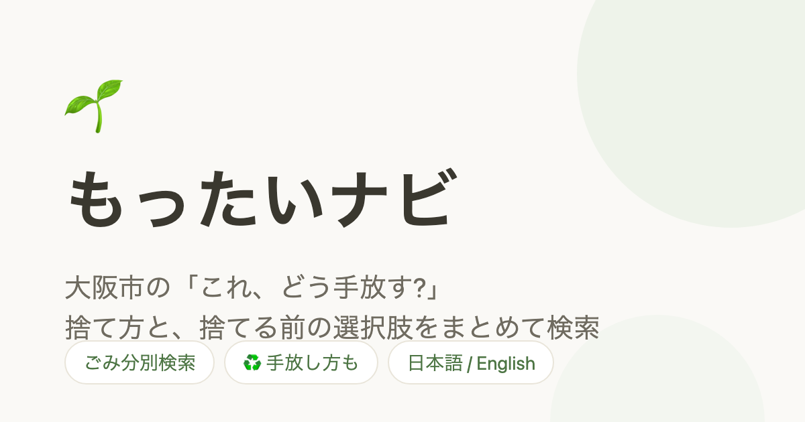

# 🌱 もったいナビ

**大阪市の「これ、どう手放す?」— 捨て方と、捨てる前の選択肢をまとめて調べられる非公式ナビ**

https://mottainavi.kaztada.eco



品目名を検索すると、大阪市での正しい分別区分・出し方に加えて、**捨てる前に検討できる選択肢**(リユース・拠点回収・寄付・買取・譲り合い)を1画面で提示します。コンセプトは「捨てる前に、ちょっとだけ立ち止まれる場所」。

## 特徴

- 🔍 **1,000品目超のあいまい検索** — ひらがな・カタカナ・漢字・別名・英語のどれでもヒット(例:「ぎたー」「PET」「iron」)
- ♻️ **手放し導線** — 品目カテゴリに応じたリユース選択肢を、押しつけないトーンで提案
- 🗑 **正確さ優先の分別情報** — 市の注意文言を原文のまま全文表示。粗大ごみは手数料と申込先(ネット/電話)つき
- 🌏 **日英切替** — UI全文言+主要299品目の英訳。英訳のない品目はローマ字表示でフォロー
- 📱 **モバイルファースト・静的サイト** — サーバもDBも使わない SSG。すべての品目ページを事前生成

## 技術スタック

- Next.js 15 (App Router) + TypeScript / Tailwind CSS v4
- 検索: Fuse.js(クライアントサイド・軽量インデックスを遅延ロード)
- データ検証: zod(パイプラインとアプリで共用)
- データパイプライン: TypeScript + cheerio + kuromoji(`scripts/build-data.ts`)
- ホスティング: Vercel

## 開発

```bash
npm install
npm run dev          # 開発サーバ
npm run build-data -- --municipality osaka-city   # 自治体の品目データ生成(キャッシュ優先。--refresh で再取得)
npm run build-registry   # 全国の自治体レジストリを総務省コードから再生成(通常は不要)
npm test             # Vitest(パース・検索正規化のユニットテスト)
npm run build        # 本番ビルド(全品目SSG)
```

データ更新は `npm run build-data -- --municipality <slug>` → 差分コミット → push(Vercel が自動デプロイ)。配信用の `public/data/` は `npm run build` の prebuild で自動生成される。

## データ出典

品目データは大阪市「[品目別収集区分一覧表](https://www.city.osaka.lg.jp/kankyo/page/0000201907.html)」([CC-BY 4.0](https://creativecommons.org/licenses/by/4.0/deed.ja))を加工して作成しています。

**本サイトは大阪市の公式サービスではありません。** 分別ルールは変わることがあります。最新・正確な情報は必ず[大阪市公式サイト](https://www.city.osaka.lg.jp/kurashi/category/3016-1-2-0-0-0-0-0-0-0.html)でご確認ください。

## ライセンス

- コード: [MIT](LICENSE)
- 品目データ: 出典 大阪市「品目別収集区分一覧表」(CC-BY 4.0)

## 作者

Kaz Tada — [kaztada.eco](https://kaztada.eco) / #ちるエコ日和

誤りの報告・提案は [Issues](https://github.com/kaztada/mottainavi/issues) へどうぞ。
