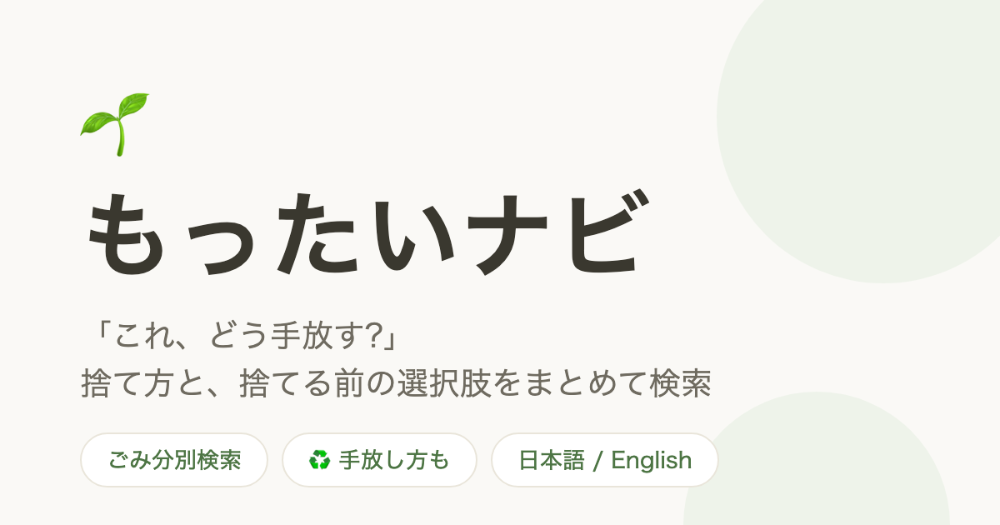

# 🌱 もったいナビ

**「これ、どう手放す?」— ごみの捨て方と、捨てる前の選択肢をまとめて調べられる非公式ナビ**

https://mottainavi.kaztada.eco



お住まいの自治体を選んで品目名を検索すると、その自治体での分別区分・出し方に加えて、**捨てる前に検討できる選択肢**(リユース・拠点回収・寄付・買取・譲り合い)を1画面で提示します。コンセプトは「捨てる前に、ちょっとだけ立ち止まれる場所」。

## 特徴

- 🔍 **あいまい検索** — ひらがな・カタカナ・漢字・別名・英語のどれでもヒット(例:「ぎたー」「PET」「iron」)
- ♻️ **手放し導線** — 品目カテゴリに応じたリユース選択肢を、押しつけないトーンで提案
- 🗑 **正確さ優先の分別情報** — 自治体の注意文言を欠かさず表示。粗大ごみは申込先(ネット・電話)と、データにある自治体では手数料も
- 🌏 **日英切替** — UI の全文言と、品目名の一部の英訳(順次追加中)。英訳のない品目はローマ字表示でフォロー
- 📱 **モバイルファースト・静的サイト** — サーバもDBも使わない。品目データは静的な JSON として配信し、ブラウザで読み込んで表示

## 対応している自治体

| 自治体             | 出典(各自治体が公開しているデータ)                                                                                   | ライセンス   |
| ------------------ | -------------------------------------------------------------------------------------------------------------------- | ------------ |
| 大阪市(大阪府)     | [品目別収集区分一覧表](https://www.city.osaka.lg.jp/kankyo/page/0000201907.html)                                     | CC BY 4.0    |
| 横浜市(神奈川県)   | [ごみと資源物の出し方一覧表](https://www.city.yokohama.lg.jp/kurashi/sumai-kurashi/gomi-recycle/gomi/dashikata.html) | CC BY 4.0    |
| 東大阪市(大阪府)   | [ゴミの分別方法一覧](https://data.bodik.jp/dataset/272272_28)                                                        | CC BY 4.0    |
| 枚方市(大阪府)     | [ごみの分別一覧表50音順オープンデータ](https://www.city.hirakata.osaka.jp/0000024067.html)                           | CC BY 2.1 JP |
| 河内長野市(大阪府) | [家庭用ごみの分別辞典](https://www.city.kawachinagano.lg.jp/soshiki/15/1796.html)                                    | CC BY 4.0    |
| 平塚市(神奈川県)   | [ごみの分別方法一覧](https://www.city.hiratsuka.kanagawa.jp/keikaku/page81_00019.html)                               | CC BY 4.0    |
| 鹿児島市(鹿児島県) | [ごみの分別一覧](https://data.bodik.jp/dataset/462012_gomibunbetsu)                                                  | CC BY 4.0    |
| 沖縄市(沖縄県)     | [ごみの分別方法一覧](https://data.bodik.jp/dataset/472115_separate_garbage_20241201)                                 | CC BY 4.0    |
| 須賀川市(福島県)   | [ゴミの分別方法一覧](https://www.city.sukagawa.fukushima.jp/shisei/gaiyo/opendata/1004902/8865.html)                 | CC BY 4.0    |
| 長浜市(滋賀県)     | [ごみ分別表](https://data.bodik.jp/dataset/252034_garbage_separation)                                                | CC BY 4.0    |

品目データを二次利用できるライセンスで公開している自治体から、順に追加しています。まだ対応していない自治体を選ぶと、その自治体の公式サイトへの案内を表示します。

## 技術スタック

- Next.js 15 (App Router) + TypeScript / Tailwind CSS v4
- 検索: Fuse.js(クライアントサイド・軽量インデックスを遅延ロード)
- データ検証: zod(パイプラインとアプリで共用)
- データパイプライン: TypeScript + cheerio + exceljs + kuromoji(`scripts/build-data.ts`、自治体ごとのアダプタは `scripts/adapters/`)
- ホスティング: Vercel

## 開発

```bash
npm install
npm run dev          # 開発サーバ
npm run build-data -- --municipality osaka-city   # 自治体の品目データ生成(キャッシュ優先。--refresh で再取得)
npm run build-data -- --all   # 対応しているすべての自治体の品目データを生成
npm run check-data   # 生成したデータの検査(再現性・版番号・変わる品目の一覧)
npm run build-registry   # 全国の自治体レジストリを総務省コードから再生成(通常は不要)
npm test             # Vitest(パース・検索正規化のユニットテスト)
npm run build        # 本番ビルド
```

- 配信用の `public/data/` は `npm run build` の prebuild で自動生成される
- 変更はプルリクエストで行う。CI(GitHub Actions)が lint・テスト・データの検査・ビルドを実行し、main へのマージで Vercel が自動デプロイする
- データの更新は、週1回の GitHub Actions(`.github/workflows/update-data.yml`)が各自治体の公開データを確かめ、更新があればプルリクエストか Issue を作る
- 設計書は `docs/`(要件・データ構造・画面・技術選定・ロードマップ)

## データ出典

品目データは、上の表の各自治体が公開しているデータを加工して作成しています。自治体ごとの出典の表記(各自治体の利用規約に沿った書き方)は、サイトの各品目ページと、自治体ごとの「このサイトについて」ページに表示しています。

- [CC BY 4.0](https://creativecommons.org/licenses/by/4.0/deed.ja)
- [CC BY 2.1 JP](https://creativecommons.org/licenses/by/2.1/jp/)

**本サイトは各自治体の公式サービスではありません。** 分別ルールは変わることがあります。最新・正確な情報は、必ず各自治体の公式サイトでご確認ください。

## ライセンス

- コード: [MIT](LICENSE)
- 品目データ: 各自治体のライセンス(上の表)に従います

## 作者

Kaz Tada — [kaztada.eco](https://kaztada.eco) / #ちるエコ日和

誤りの報告・提案は [Issues](https://github.com/kaztada/mottainavi/issues) へどうぞ。
